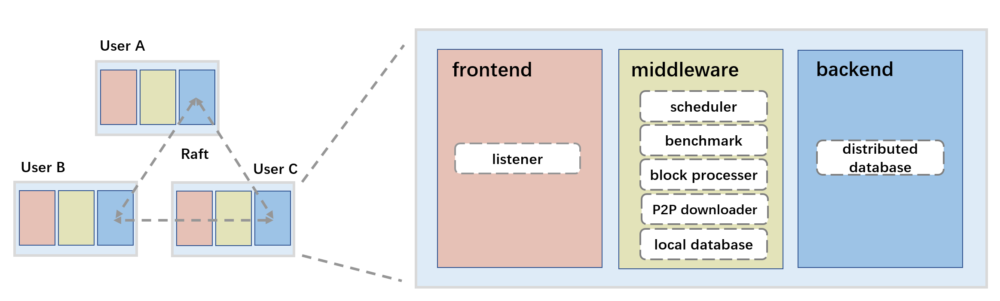
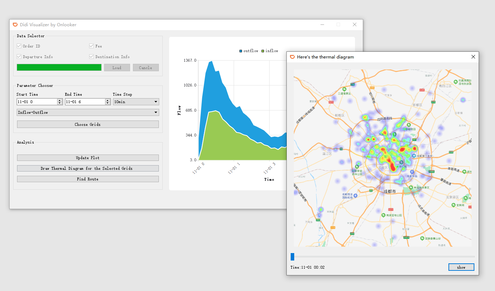

## What am I doing recently?

[](https://github.com/ChenWendi2001)
#### 📊 Weekly development breakdown

<!--START_SECTION:waka-->


```text
From: 12 March 2023 - To: 19 March 2023

Python       34 hrs 44 mins  █████████████████████▒░░░   84.80 %
YAML         4 hrs 46 mins   ███░░░░░░░░░░░░░░░░░░░░░░   11.65 %
Other        58 mins         ▓░░░░░░░░░░░░░░░░░░░░░░░░   02.36 %
```


<!--END_SECTION:waka-->

* * *
## Selected Projects
### StreamRipper 💻
  


StreamRipper is an adaptive distributed network cache on LAN. It provides an acceleration service for [Bilibili](https://www.bilibili.com).

[Check the Project Repo](https://github.com/ChenWendi2001/StreamRipper)


### Didi Visualizer 📊

 


A cross-platform multi-thread GUI which can analyze Didi demand data and provide valuable suggestions. This is a project for *CS241, SJTU*. 


[Check the Project Repo](https://github.com/ChenWendi2001/Principles-and-Practice-of-Problem-Solving)


### MIPS CPU 💻


I used Verilog to implement a 5-stage pipelined MIPS processor. It has many advanced features including forwarding, branch-not-taken and cache.

[Check the Project Repo](https://github.com/ChenWendi2001/MIPS-CPU)


### RISC-V CPU Simulator 💻
  

In this project, I implemented a RISC-V simulator supporting *RV32I Base Integer ISA* through C++. It has a 5-stage pipeline to enable parallel execution. Also, data & control hazards are handled through forwarding and dynamic branch prediction.


[Check the Project Repo](https://github.com/ChenWendi2001/RISCV-Simulator)

### Gobang AI 🎲
 

Here's an interesting project I finished in summer holiday. With a 6-step searching depth and alpha-beta pruning, this AI is capable of beating a novice in Gobang. Besides, it's the first GUI application I developed through Qt.

[Check the Project Repo](https://github.com/ChenWendi2001/GoBang_AI)

>In addition, I like to develop some useful tools which simplify workflow. Here're some examples below.

### SJTU & FDU ICS Generator 📆


This is a script that helps SJTUer and FDUer to import their class schedule into mobile phones.

[SJTU version](https://github.com/ChenWendi2001/SJTU_ics_generator) and [FDU version](https://github.com/ChenWendi2001/fdu_ics_generator) are provided.

* * *

## Professional Services
Teaching Assistant for
- CS1958: Programming and Data Structure I (Fall 2021), John Hopcroft Class
- CS1959: Programming and Data Structure II (Spring 2022), John Hopcroft Class


## Honor
- [Zhiyuan Honors Program (Engineering)](https://zhiyuan.sjtu.edu.cn/ "Zhiyuan College")
- SJTU Academic Scholarship B 2020
- Zhiyuan Honors Scholarship 2020
- SJTU Academic Scholarship B 2021
- Zhiyuan Honors Scholarship 2021
- HyperGryph Scholarship


## Contact
- E-mail: chenwendi-andy@sjtu.edu.cn
- GitHub: [ChenWendi2001](https://github.com/ChenWendi2001 "Check GitHub")


